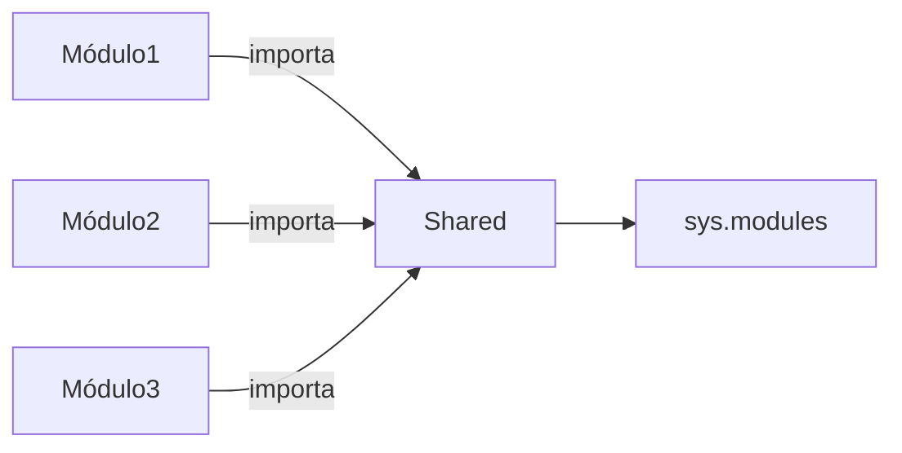

# Paquetes
Los paquetes en python son directamente las carpetas que alojan los archivos .py (módulos).

## Importación
Lo más correcto en Python es emplear la ruta absoluta del módulo, para que haya una mayor claridad en dónde se encuentra ese módulo.
```python
# shared.py (módulo compartido)
contador = 0

# mod1.py, mod2.py, mod3.py (cada uno hace):
from shared import contador

# En mod1.py
contador += 1  # ¡Todos los módulos verán el cambio!
```


### Importaciones relativas
Pero también podemos importar usando rutas relativas. 
```python
# En modulo2.py (importar modulo1 del mismo paquete padre)
from ..modulo1 import funcion_a
```
Usamos `.` para referenciar módulos en el mismo paquete o `..` para subir un nivel.

Funciona de manera similar a TypeScript, pero omitiendo los `/`.
